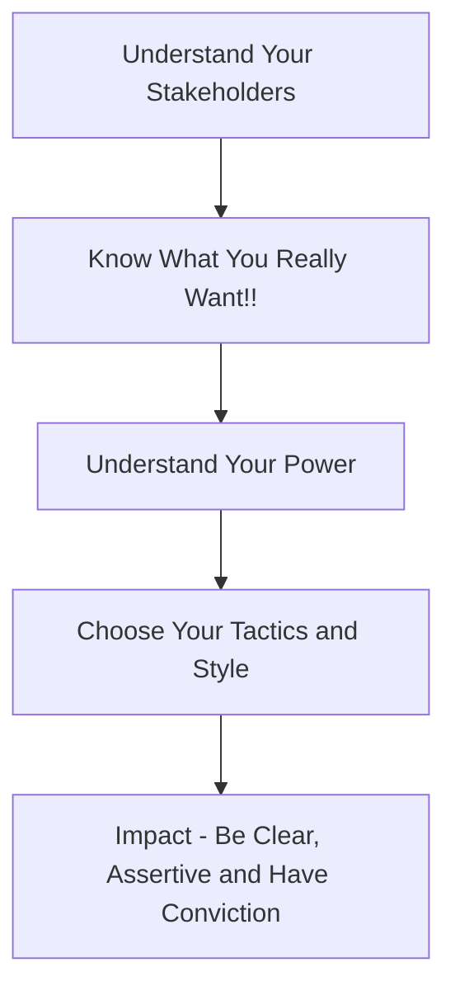
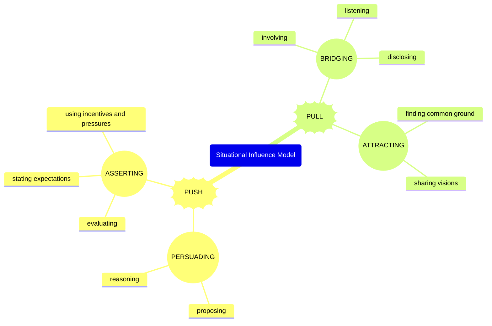

# Influence at work

## General flow

```mermaid
graph TD
    A[Understand Your Stakeholders] --> B[Know What You Really Want!!];
    B --> C[Understand Your Power];
    C --> D[Choose Your Tactics and Style];
    D --> E[Impact - Be Clear, Assertive and Have Conviction];
```

> Talk to stakeholders about them, rather than at them about you

## Influence model (push vs pull)

```mermaid
mindmap
  root(Situational Influence Model)
      ))PUSH((
        ((PERSUADING))
          proposing
          reasoning
        ((ASSERTING))
          evaluating
          stating expectations
          using incentives and pressures
      ))PULL((
        ((BRIDGING))
          involving
          listening
          disclosing
        ((ATTRACTING))
          finding common ground
          sharing visions
```
