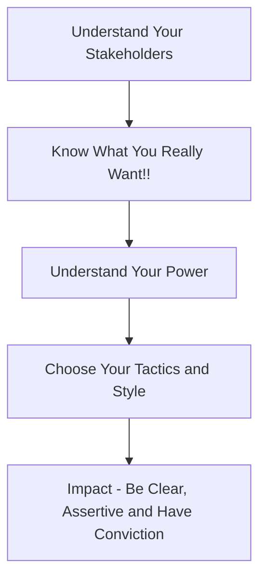
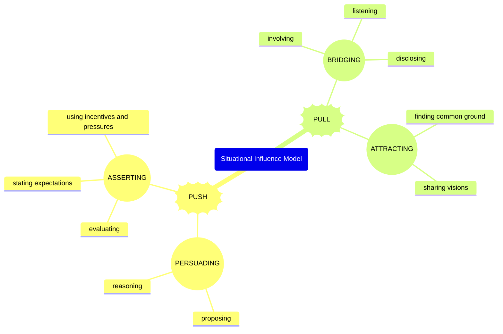
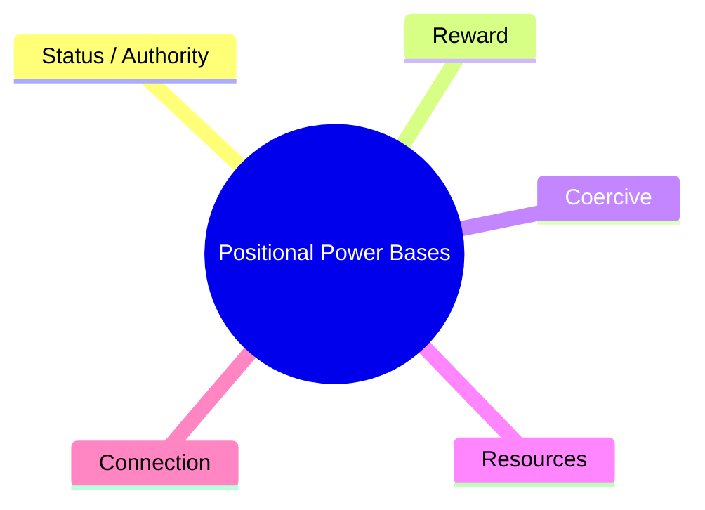
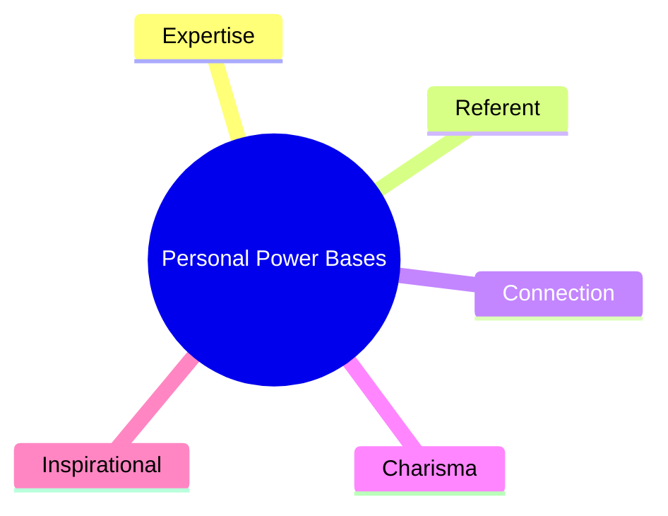

# Influence at work

## General flow

> Talk to stakeholders about them, rather than at them about you

## Influence model (push vs pull)

## Power vs Interest

|                     | **High Interest** | **Low Interest** |
|---------------------|-------------------|------------------|
| **High Power**      | Must be kept   fully informed   and satisfied | Once you have buy in   keep informed only about   major progress and problems |
| **Low Power**       | Keep their   motivation high   by including them | Give them the information necessary   so to understand   the bare necessities of the project | 

High power / High interest should be the focus of your communication.

Consider what your stakeholders should:

- Think
- Do
- Feel

What should you?

## Power bases

Various strengths stemming from your position or personality and knowledge.

### Positional

### Personal

